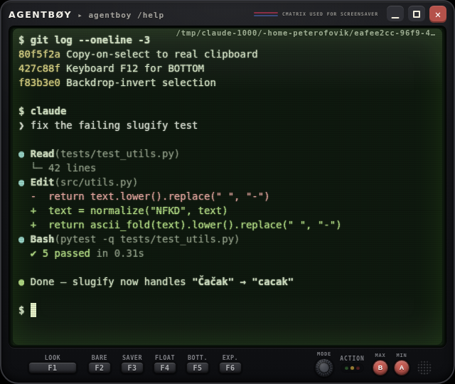
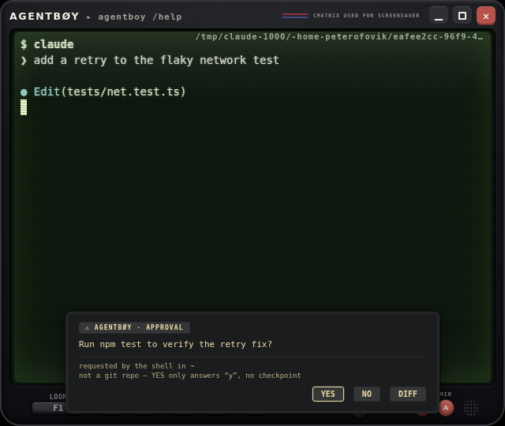
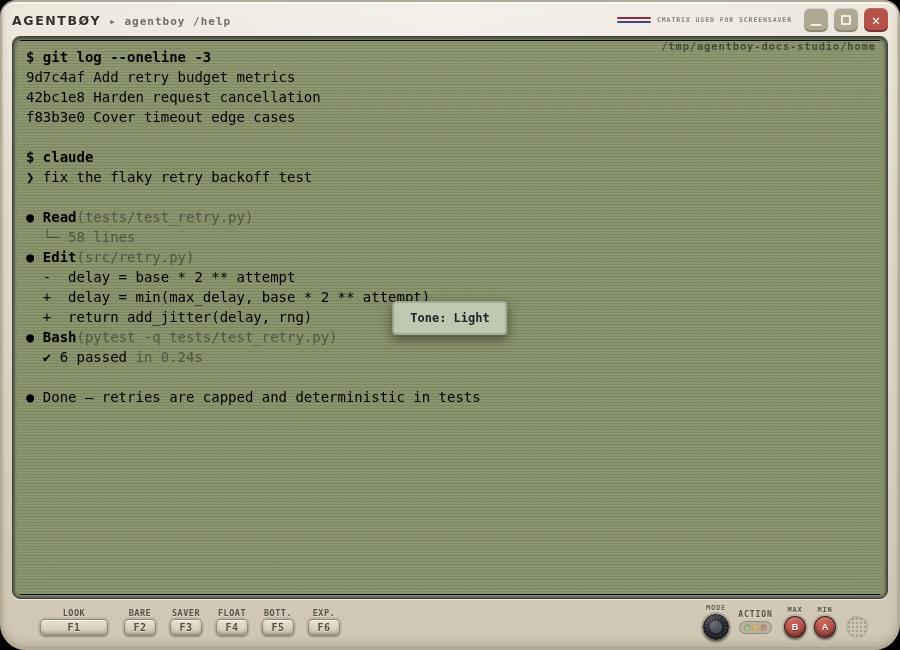
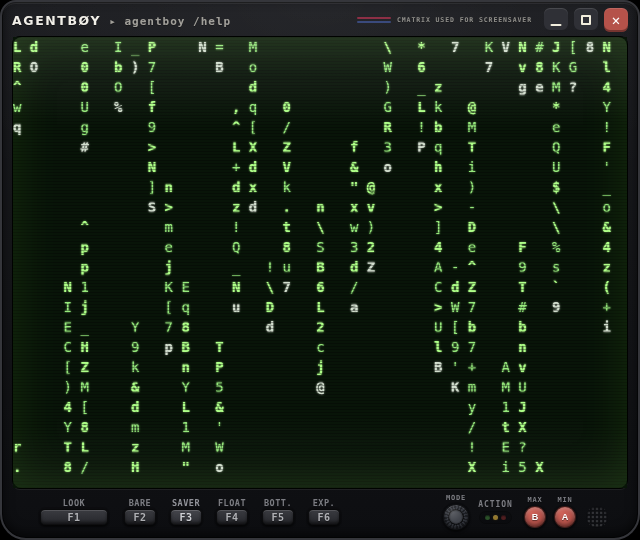

# agentboy

[](https://www.npmjs.com/package/agentboy)
[](https://github.com/pedjaurosevic/agentboy/actions/workflows/build.yml)
[](LICENSE)

A retro handheld-console terminal designed specifically for AI pair programming. Inspired by classic handhelds, agentboy bridges the gap between nostalgic aesthetics and modern agentic workflows.

**Website: [pedjaurosevic.github.io/agentboy](https://pedjaurosevic.github.io/agentboy/)**



| OSC 98 approval dialog | G-Shock Red theme | cmatrix screensaver |
| --- | --- | --- |
|  |  |  |

## Features

- 🎮 **Nostalgic UI**: A Game Boy style chassis with labelled function buttons, A/B buttons, a status LED and a speaker grille — all rendered entirely with CSS.
- 🕹️ **Five Shell Layouts (MODE)**: the round MODE knob cycles Compact (LOOK menu + 5 window keys) → Full (all 12 keys) → **Robo-Terminal** (brushed gunmetal with machined vent ribs on the side rails) → **Robo-Grip** (brushed gunmetal + rubber side grips) → **Fable Deck** (midnight lacquer + brass, 12 bigger keys in two rows). FRAME re-liveries the robo shells **and** the Fable Deck; TONE Light/Sepia flips them to worn-beige / ivory versions (except the vivid Red and Atomic Orange frames, which stay fully saturated in every tone — their washed looks are the separate Faded Red / Faded Orange stops).
- 🎨 **Fourteen Themes × Three Tones**: Agentboy DMG, Monochrome E-Ink, Charcoal, G-Shock Red, Dystopian, Phosphor, Cyberpunk, Sapphire, Atomic Orange, Rust Bunker, Vintage Hi-Fi, Olive Drab, Phosphor Red and Phosphor Amber — each in a dark, paper-light or warm sepia tone, with contrast auto-clamped to stay readable.
- 📺 **Authentic CRT Effects**: Eight tube modes — shadow mask, aperture grille, slot mask, curved glass (with a bulge that inflates with intensity), the full tube, clean scanlines, vector glow, and off — plus six combinable extras that stack on any mode: **Sweep** (rolling retrace band), **Noise** (broadcast grain), **Chroma** (RGB fringe), **Flicker**, **Vignette**, and **Curve** — an old-tube turn-on flash, phosphor bloom and 20 intensity steps.
- 🤖 **LLM Native Approval Flow**: CLI tools and agents can request user approval through an escape sequence (`OSC 98 ; prompt=<question>`) — the terminal shows a retro RPG-style dialog, git-checkpoints the pane's working directory on YES, and answers `y`/`n` back to the shell. The dialog renders **on the chassis** (outside the screen) and names the requesting shell's working directory and the exact git repo a YES will commit — so a spoofed escape sequence, which can only paint inside the screen, can't fake it. Set `"osc98": "led-only"` (flag the LED, no dialog, no auto-answer) or `"off"` in the config to lock it down further. The full escape-sequence reference, including the anti-spoofing design, lives in **[docs/protocol.md](docs/protocol.md)**.
- 🔍 **Diff Inspector Cartridge**: View proposed code changes in a dedicated UI panel *before* accepting them from the AI agent.
- ⏪ **Undo Checkpoints**: Natively tracks AI code modifications via Git, in the working directory of the active pane's shell. Right-click the `F1` theme button to instantly roll back if the AI makes a mistake.
- 🚦 **ACTION Status LED & Audio**: A traffic-light style LED shows what is happening at a glance — dim yellow when idle, bright yellow while you type, green while the agent produces output, red when the terminal waits for your approval. CLI tools can drive it via `OSC 99 ; led=<state>`, with 8-bit success and error audio feedback.
- 🪟 **Split Panes**: Terminator-style splits, each pane running its own real PTY, with draggable dividers, search, and clipboard support (CLIPBOARD + X11 PRIMARY).
- 📐 **Window Modes**: Snap grid (3×2), full-height column, expand-over-toolbar, a free-floating resizable mode, and a frameless mode that hides the chassis entirely.
- 🟩 **cmatrix Screensaver**: One button starts `cmatrix` in an overlay on its own PTY; any key or click exits. (Install `cmatrix` to use it.)

## Requirements

- Linux with X11 (primary target; window snapping relies on X11)
- Node.js 20+
- Build tools for native modules (`python3`, `make`, `g++`) — needed to compile `node-pty`
- Optional: `cmatrix` for the built-in screensaver (`sudo apt install cmatrix`)

agentboy is Linux-first and published for Linux only (`"os": ["linux"]` on npm). The checkpoint, diff and approval-origin features read `/proc`, so macOS/Windows are not supported.

## Installation

### From npm

```bash
npm install -g agentboy
agentboy
```

`node-pty` is compiled for Electron during install, so the build tools listed above must be present.

### From source

```bash
# Clone the repository
git clone https://github.com/pedjaurosevic/agentboy.git
cd agentboy

# Install dependencies (node-pty is rebuilt for Electron automatically)
npm install

# Start the terminal
npm start
```

If `npm start` fails with a `node-pty` ABI error, rebuild the native module manually:

```bash
npm run rebuild:native
```

### Troubleshooting

- **`npm install -g agentboy` fails during postinstall** — the `node-pty` native build needs `python3`, `make` and `g++` (`sudo apt install python3 make g++` / `pacman -S python base-devel`), then reinstall.
- **The app refuses to start with a Chromium sandbox error** — run once with `AGENTBOY_NO_SANDBOX=1 agentboy` and please open an issue with your distro name; the launcher normally detects this case itself.

### Uninstall

```bash
npm uninstall -g agentboy
rm ~/.agentboy.json   # optional: your saved appearance/config
```

## Chassis Controls

Every button has its function printed on the shell above it. These are on-screen buttons on the chassis, not physical F-keys (the F1–F12 labels are position markers, like SELECT/START on a real handheld).

- **`MODE`** (round knurled knob at the head of the right cluster): cycle the shell layout — Compact → Full → Robo-Terminal → Robo-Grip → Fable Deck (`Alt+M` from the keyboard)
- **`LOOK`** (Compact layout, or `Alt+L` anywhere): the appearance menu — Theme (14 presets), Tone (dark / light / sepia), CRT (8 modes × 20 intensity steps), FX (Sweep / Noise / Chroma / Flicker / Vignette / Curve — independent CRT extras that stack on any mode except Off), Wear (new / worn / cracked / glass), Frame and Divider; live-apply, the terminal stays visible above it
- **Full / robo / Deck layouts — all 12 keys** (Compact shows the last five as F2–F6):
  - **F1 `TONE`**: dark → light → sepia (right-click reverses)
  - **F2 `FRAME`**: cycle the chassis frame style — Default → Dark → Retro → White → Red → Faded Red → Phosphor → Cyberpunk → Ocean → Mecha → Atomic Orange → Faded Orange → Grape GBC → Woodgrain; re-liveries the robo shells and the Fable Deck too
  - **F3 `THM`**: cycle the theme preset (1–14, right-click reverses)
  - **F4 `CRT`**: cycle the CRT effect — Shadow Mask → Aperture Grille → Slot Mask → Glass → Full → Scanlines → Vector Glow → Off (coming back from Off plays the turn-on flash)
  - **F5 `CRT−` / F6 `CRT+`**: CRT intensity down / up (20 levels)
  - **F7 `WEAR`**: chassis finish — new → worn → cracked → glass
  - **F8 `BARE`**: hide the chassis — bare terminal (same key or right-click restores)
  - **F9 `SAVER`**: toggle the cmatrix screensaver on / off (any key or click exits too)
  - **F10 `FLOAT`**: free-floating window — leave the 3×2 snap grid, resize freely
  - **F11 `BOTTOM`**: scroll the active pane to the bottom (same as `Ctrl+End`)
  - **F12 `EXPAND`**: with the tall column (`B`) active, expand over the toolbar / back
- **`ACTION` LED**: status traffic light — dim yellow idle, bright yellow typing, green agent output, red waiting on you (approval dialog, or the agent printed a numbered option menu / y/n question and went quiet)
- **B `MAX` / A `MIN`**: full-height column mode / snap back to the 3×2 grid
- **Speaker** (round grille right of `A`): master sound toggle — ON starts the built-in tune (*Phosphor Drift*, a cozy lofi loop played off an imaginary cassette; starts quiet at 20% volume, and the speaker glows while playing) and enables the button/typing sound effects; OFF silences both. All effect sounds are derived from the tune itself — D-major pentatonic, soft triangle waves, including a whisper-quiet typing tick

## Keyboard Shortcuts

| Shortcut | Action |
| --- | --- |
| `Ctrl+Shift+E` / `Ctrl+Shift+O` | Split pane vertically / horizontally |
| `Ctrl+Shift+C` / `Ctrl+Shift+V` | Copy / paste — selecting text already copies it (clipboard + X11 selection; middle-click pastes the selection) |
| `Ctrl+Shift+F` | Search in the active pane (`Esc` closes) |
| `Ctrl+Shift+A` / `Ctrl+Shift+X` | Select all / clear the active pane |
| `Ctrl+D` (empty prompt) or `exit` | End the shell and close the active pane |
| `Ctrl` + `+` / `-` / `0` | Font zoom in / out / reset (also `Ctrl` + mouse wheel) |
| `Ctrl+End` | Scroll to the bottom |
| `F7` (keyboard key) | CRT intensity up |
| `F10` (keyboard key) | Toggle the cmatrix screensaver |
| `F11` (keyboard key) | Toggle the free-floating window mode |
| `F12` (keyboard key) | Scroll the active pane to the bottom |

Type `agentboy /help` inside the terminal (or click the `▸ agentboy /help` subtitle on the chassis) to open the in-app help overlay with the full controls reference.

## Configuration

Settings live in `~/.agentboy.json` (an existing `~/.retro-terminal.json` is migrated automatically). Appearance changes made from the chassis buttons — theme, tone, wear, frame, layout, CRT mode, intensity and FX toggles, font size, sound mute — are saved back to the file automatically, so the terminal comes back exactly as you left it:

```json
{
  "shell": "/bin/bash",
  "theme": 1,
  "tone": "dark",
  "wear": "new",
  "layout": "compact",
  "fontSize": 14,
  "crtMode": "mask",
  "crtIntensity": 5,
  "crtSweep": false,
  "crtNoise": false,
  "outerStyle": null,
  "innerStyle": null,
  "sfxMuted": true,
  "osc98": "on"
}
```

`tone` is `dark`, `light` or `sepia`; `wear` is `new`, `worn`, `cracked` or `glass`; `layout` is `compact`, `full`, `roboterminal`, `robogrip` or `fable`; `crtMode` is one of `mask`, `grille`, `slot`, `glass`, `full`, `scanlines`, `vector`, `off`; `crtIntensity` is `0`–`19`; `crtSweep`/`crtNoise`/`crtChroma`/`crtFlicker`/`crtVignette`/`crtBulge` are booleans for the combinable CRT extras; `outerStyle`/`innerStyle` accept `dark`, `retro`, `white`, `red`, `red-pale`, `phosphor`, `cyberpunk`, `ocean`, `mecha`, `orange`, `orange-pale`, `grape`, `wood` or `null` for the default chassis; `osc98` is `on` (default), `led-only`, or `off`.

## Development

```bash
npm run build   # typecheck + main/renderer build + static assets
npm test        # unit tests (node:test; bundled with esbuild, no extra deps)
```

Pure logic lives in dedicated renderer modules (`color.ts`, `themes.ts`, `sgr-filter.ts`, `grid.ts`, `led-heuristics.ts`, `paste.ts`) with unit tests under `tests/unit/`. CI runs the build and the test suite on three distributions.

## Built With

- [Electron](https://www.electronjs.org/)
- [xterm.js](https://xtermjs.org/)
- [node-pty](https://github.com/microsoft/node-pty)
- [esbuild](https://esbuild.github.io/)

## License

This project is licensed under the MIT License - see the [LICENSE](LICENSE) file for details.
